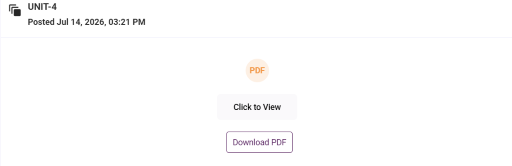
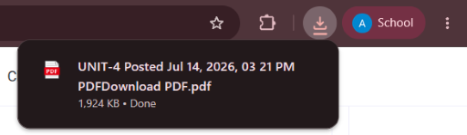

# EasyLMS

EasyLMS adds a **Download** button beside "Click to View" button in PDF note listings in PULMS(Parul E-learning Portal).

## Requirements

- Google Chrome or another Chromium-based browser
- An active account on PULMS

## Installation in Chrome

1. Download the latest `EasyLMS.zip` release.
2. Extract the ZIP to a folder.
3. Open `chrome://extensions` in Chrome.
4. Enable **Developer mode**.
5. Click **Load unpacked**.
6. Select the extracted folder.
7. Open or reload PULMS.

The extension should now add a **Download** button below each `Click to View` PDF control.

## Usage

1. Sign in to PULMS.
2. Navigate to subject page with PDF files.
3. Click **Download** for the PDF you want.
4. The PDF will be downloaded to your default/selected download location.

## Updating

1. Download and extract the new release.
2. Open `chrome://extensions`.
3. Replace the files in the existing EasyLMS folder with the files from the
   new release.
4. Return to `chrome://extensions` and click **Reload** on EasyLMS.

## Supported portal

EasyLMS is configured for:

```text
https://elearning.paruluniversity.ac.in/
```

The extension requires access to the portal's PDF viewer and storage origins
to resolve and download authenticated PDF documents.

## Screenshots




## Privacy

EasyLMS does not collect or transmit personal data, credentials, authentication
tokens, or document contents. It uses the portal's existing authenticated
session only when the user explicitly clicks **Download**.